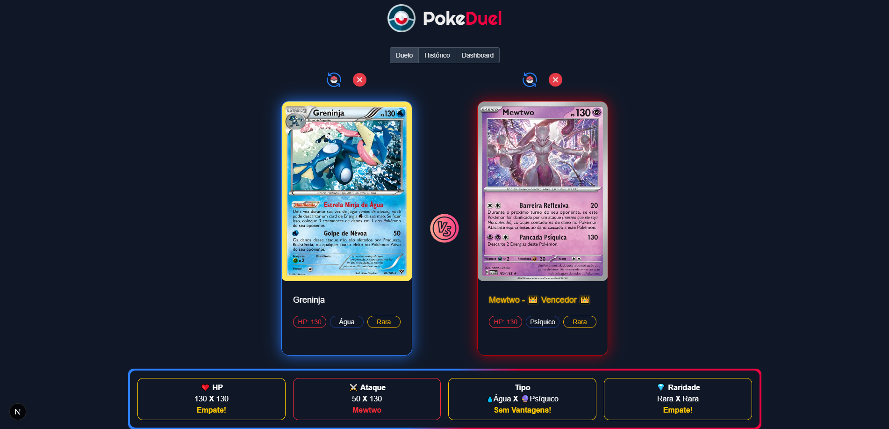
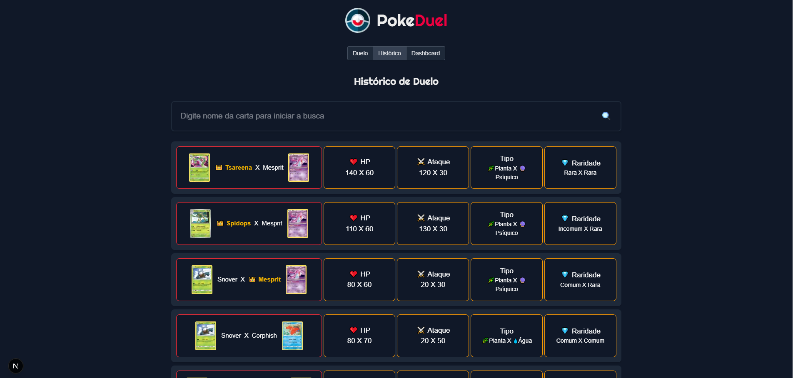
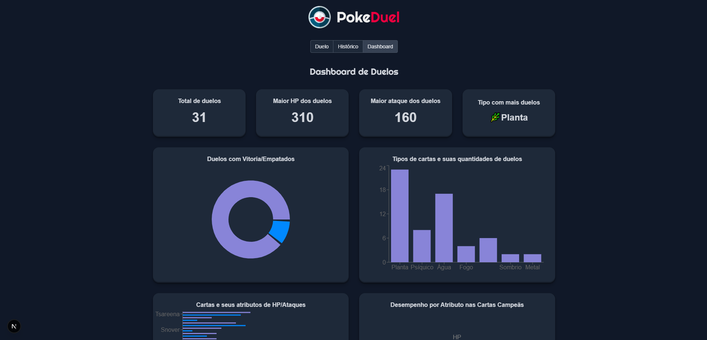
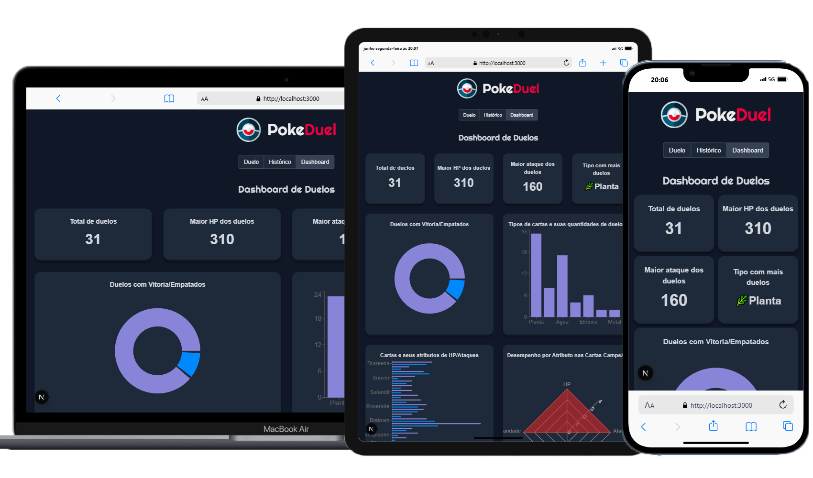

# 🧩 PokeDuel — Comparador de Cartas Pokémon TCG

PokeDuel é uma aplicação web desenvolvida com **React + Next.js** que permite aos usuários compararem cartas do universo Pokémon TCG. Com uma abordagem divertida e moderada, os duelos consideram atributos selecionados para decidir o vencedor entre dois cards.

---

## ✨ Funcionalidades

- ⚔️ **Duelo de Cards**  
  Compare **dois cards** Pokémon em um duelo baseado em atributos como:

  - Ataque
  - HP
  - Tipo
  - Raridade  
    ⚠️ A comparação não é 100% justa, mas segue uma lógica moderada para tornar a disputa equilibrada e divertida.

- 🕹️ **Escolha de Cards**  
  O usuário escolhe manualmente os dois cards para disputar o duelo.

- 📜 **Histórico de Duelos**  
  Página com o **histórico completo** de batalhas realizadas, informando:

  - Vencedor
  - Nome dos Pokémon
  - Opção de filtro por nome do card

- 📊 **Dashboard Estatístico**  
  Tela com **análises estatísticas** baseadas nos dados do histórico:
  - Total de duelos
  - Quantidade de duelos com vencedor ou empate
  - **Gráficos disponíveis:**
    - HP de todos os cards que duelaram
    - Ataque de todos os cards que duelaram
    - Tipo com mais duelos
    - Maior ataque entre todos os duelos
    - Maior HP entre todos os duelos
    - Desempenho por atributo nas cartas campeãs (HP, ataque, raridade e tipo)
    - Quantidade de duelos por tipo de carta

---

## 🛠️ Tecnologias e Ferramentas

- ⚛️ **React** — UI reativa e modular
- 🔼 **Next.js** — Gerenciamento de rotas e SSR
- 🟦 **TypeScript** — Tipagem estática e segurança no desenvolvimento
- 📡 **Axios** — Consumo da API [TCGdex](https://www.tcgdex.net/)
- 🎨 **TailwindCSS** — Estilização rápida e responsiva
- 🧠 **Context API** — Compartilhamento e persistência de estados entre componentes
- 🪝 **Hooks customizados** — Gerenciamento e reaproveitamento do histórico de duelos
- 💾 **LocalStorage** — Armazenamento persistente dos dados do histórico
- 📊 **Recharts** — Criação de gráficos dinâmicos e interativos
- 🧪 **Jest** — Testes unitários com cobertura de código
- 🧱 **Arquitetura em features** — Organização das páginas e componentes por domínio
- 📱 **Responsividade** — Suporte a monitores, notebooks, tablets e smartphones

---

## 🖼️ Screenshots

### 🔍 Página de Duelo



### 📜 Página de Histórico



### 📊 Dashboard Estatístico



### 📱 Responsividade



---

## 🚀 Instalação e Execução

```bash
# Clone o repositório
git clone https://github.com/seu-usuario/pokeduel.git
cd pokeduel

# Instale as dependências
npm install

# Rode o projeto em modo de desenvolvimento
npm run dev
```

Acesse `http://localhost:3000` no navegador para visualizar o projeto.

---

## 🧪 Testes

```bash
# Executar testes com cobertura
npm run test -- --coverage
```

---

## 📁 Estrutura do Projeto

```
src/
├── features/               # Organização por funcionalidades
│   ├── historico/          # Página e componentes do histórico
│   └── dashboard/          # Página e gráficos da dashboard
├── components/             # Componentes reutilizáveis
├── hooks/                  # Hooks customizados
├── context/                # Context API para estado global
├── data/                   # Listas de cartas excluídas (energias e treinadores)
├── services/               # Configurações de requisições (axios)
└── lib/                    # Funções utilitárias de lógica de comparação (raridade e tipo)
```

---

## 🧠 Inspiração

O projeto nasceu da vontade de criar uma experiência divertida de comparação entre cartas Pokémon TCG, usando dados reais da API TCGdex, com foco em visualizações claras e interativas.

---

## 📌 Observações

- Os critérios de comparação entre os cards não seguem uma regra oficial da franquia.
- A aplicação é um projeto pessoal com fins educativos e demonstração de habilidades.

---

## 📃 Licença

Este projeto está licenciado sob a [MIT License](LICENSE).
